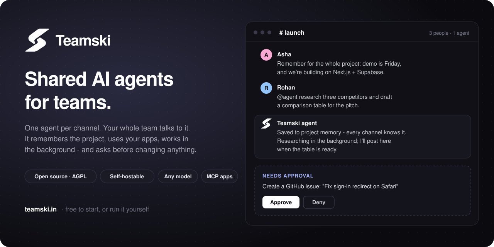
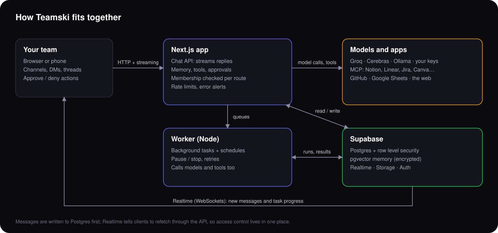

<div align="center">



<br/>


<br/>

### The AI teammate your whole team shares.

One agent per channel, with memory, connected apps and approvals.<br/>
Open source, self-hostable, and free to start at **[teamski.in](https://teamski.in)**.

<br/>

[](https://teamski.in)
[](#-quick-start)
[](https://github.com/janakrathi/Teamski/stargazers)

[](LICENSE)


<br/>

**[✨ Features](#-what-teamski-does)** · **[🚀 Quick start](#-quick-start)** · **[🧠 How it works](#-how-it-works)** · **[🔒 Security](#-security)** · **[🗺️ Roadmap](#%EF%B8%8F-roadmap)** · **[🤝 Contributing](#-contributing)**

<br/>

⭐ **If Teamski is useful to you, a star helps other teams find it.**

</div>

<br/>

## 💡 Why Teamski

AI chat tools are built for **one person**. Your teammate's ChatGPT doesn't know what
yours decided yesterday, the project brief gets pasted into five different chats, and
nobody can see what the AI was told.

Teamski puts **one shared agent in each channel**. Everyone talks to the same agent,
which remembers the project, and anything it would change in your tools waits for a
person to approve it.

|                                   | A personal AI chat     | **Teamski**                                              |
| --------------------------------- | ---------------------- | -------------------------------------------------------- |
| Who talks to the AI               | One person             | **The whole team, in one channel**                       |
| What it remembers                 | Your own chats         | **The project: brief, decisions, stack, deadlines**      |
| Two teammates disagree            | Each has their own chat | **The agent names the conflict and asks the team**     |
| Long tasks                        | Tied to your chat      | **Run in the background and post to the channel**      |
| Changing your tools               | Varies                 | **Waits for a person to approve**                        |
| Which model                       | The vendor's           | **Built-in, local (Ollama), or your own keys**           |
| Where it runs                     | Their cloud            | **Hosted at teamski.in, or on your own server**          |

<br/>

## ✨ What Teamski does

<table>
<tr>
<td width="50%" valign="top">

### 👥 Multiplayer by design
Projects → channels → messages, plus DMs, threads, mentions, attachments, unread
counts and search. Everyone in a channel talks to the **same agent**. When teammates
contradict each other ("use React" vs "use Vue"), it says so and asks which to follow.

</td>
<td width="50%" valign="top">

### 🧠 Memory that belongs to the project
Recent turns, a rolling summary and durable facts, found by meaning with **pgvector**.
Each channel has its own memory, plus **one shared project memory**: say *"remember
this for the whole project"* and every channel's agent knows it. Encrypted at rest.

</td>
</tr>
<tr>
<td valign="top">

### 🔌 Connected apps
GitHub, Google Sheets, web search and page reading, image generation, and any remote
**MCP** server: Notion, Linear, Jira & Confluence, Asana, Canva, Sentry, Stripe,
Hugging Face, DeepWiki. One click to connect.

</td>
<td valign="top">

### ✅ Approvals, not surprises
Anything that changes a connected app, or deletes a file, **waits for a person** to
approve or deny it. Fetched web pages are treated as content to read, never as
instructions to follow.

</td>
</tr>
<tr>
<td valign="top">

### ⏳ Background tasks
Hand off research or a long write-up. A separate **worker** runs it with real pause and
stop, retries tool failures, keeps going when you close the tab, and posts the result
in the channel. Schedules too.

</td>
<td valign="top">

### 🤖 Any model
Built-in **GPT-OSS 120B** on Groq or Cerebras (fast and free), a fully local model
through **Ollama**, or a team's own Claude, ChatGPT, Gemini, Grok or other keys, with
monthly caps and a spend report.

</td>
</tr>
<tr>
<td valign="top">

### 🏢 Ready for real teams
Owner, admin and member roles · per-project plans and billing (Razorpay) · a usage
dashboard · error alerts by email · per-person rate limits · full project export.

</td>
<td valign="top">

### 🛠️ Built to be read
TypeScript end to end, one route per resource, one shared error handler, and **124
tests**. The code explains *why* as well as *what*.

</td>
</tr>
</table>

<br/>

## 🚀 Quick start

### ☁️ Hosted (no setup)

Sign up at **[teamski.in](https://teamski.in)**. The free plan includes a built-in AI,
so you can create a project, invite your team and start talking to an agent straight away.

### 🐳 Docker

```bash
git clone https://github.com/janakrathi/Teamski.git && cd Teamski
cp .env.example .env.local      # fill in the required block
docker compose --env-file .env.local up -d --build
```

Open **http://localhost:3000**. This runs the web app and the background worker; add
`--profile ollama` to also run a local model. You need a free
[Supabase](https://supabase.com) project with `supabase/migrations/ALL.sql` run once.

### 💻 From source

```bash
npm install
cp .env.example .env.local
npm run dev        # the app, on localhost:3000
npm run worker     # background tasks, in a second terminal
```

The full walkthrough covers Supabase, models, sign-in, connections, email, payments
and running in production: **[docs/SELF_HOSTING.md](docs/SELF_HOSTING.md)**.

> **Self-hosted copies get everything.** With `NEXT_PUBLIC_SELF_HOSTED=true` (the
> default in `.env.example` and the Docker image), every feature is on and the plan
> and billing screens are hidden. You run the server and bring your own AI keys, so
> there's nothing to pay for.

<br/>

## 🧠 How it works



<details>
<summary><b>Where things live in the code</b></summary>

```
app/api/chat           streaming chat: model, tools, memory, retries
app/api/...            one route per resource, each checking membership
worker/index.mts       claims background runs, advances them, honours pause
lib/ai/providers       which model, whose key, fallbacks, the call itself
lib/ai/memory.ts       window + summary + facts, channel and project scope
lib/ai/tools.ts        tool registry: schema + implementation + approval
lib/ai/web.ts          search and page reading, with the SSRF guard
lib/mcp                connected apps over MCP, with OAuth
lib/crypto/secrets.ts  AES-256-GCM sealing for keys, tokens and memory
lib/plans.ts           what each plan includes, and the checks
supabase/migrations    the schema and RLS policies; ALL.sql is all of it
```

**Stack:** Next.js 16 (App Router) · React 19 · TypeScript · Supabase (Postgres, row
level security, pgvector, Realtime, Storage, Auth) · a Node worker · Tailwind CSS ·
Resend · Razorpay.

</details>

<br/>

## 🔒 Security

- 🔐 **Encrypted at rest:** API keys, OAuth tokens, MCP sign-ins and AI memory are sealed
  with AES-256-GCM before they're stored.
- 🧱 **Row level security** on every table, plus membership checks in every API route.
- 🌐 **SSRF guard:** URLs a model picks are checked against private networks, including
  every address the name resolves to and every redirect, before any request is made.
- ✋ **Human approval** before anything changes a connected app.

More at [teamski.in/security](https://teamski.in/security). **Found a vulnerability?**
Please email **support@teamski.in** rather than opening a public issue.

<br/>

## 🗺️ Roadmap

- [ ] Stream AI replies word by word to everyone in the channel, not just the person who asked
- [ ] Presence and typing indicators
- [ ] Per-channel permissions and an audit log
- [ ] Prebuilt Docker image on a registry
- [ ] More one-click connections

Have an idea? [Open an issue](https://github.com/janakrathi/Teamski/issues).

<br/>

## 🤝 Contributing

Issues and pull requests are welcome. Start with
**[CONTRIBUTING.md](CONTRIBUTING.md)**, and look for issues labelled
`good first issue`.

<br/>

## ⭐ Star history

<a href="https://star-history.com/#janakrathi/Teamski&Date">
  
</a>

<br/>

## 📄 Licence

[GNU AGPL-3.0](LICENSE). You can use, change and self-host Teamski freely. If you run a
modified version as a service for other people, you must publish your changes under the
same licence.

<div align="center">
<br/>
Built by <a href="https://github.com/janakrathi">@janakrathi</a> · <a href="https://teamski.in">teamski.in</a>
</div>
